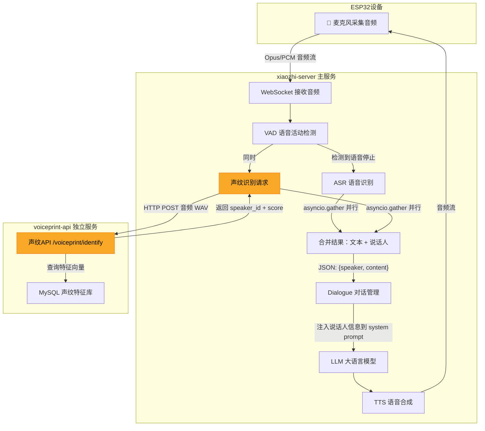
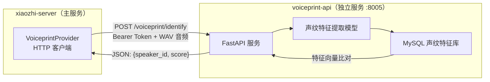

# 声纹识别在系统中的作用与位置分析

## 一句话总结

> 声纹识别是一个**可选的增强功能**，它在 ASR（语音识别）阶段**并行运行**，用于识别"谁在说话"，并将说话人身份信息注入到 LLM 的上下文中，让 AI 能够**个性化回复**不同用户。

---

## 系统架构总览



---

## 声纹识别的作用

| 作用 | 说明 |
|------|------|
| **识别说话人身份** | 通过语音特征匹配，判断当前说话的人是"张三"还是"李四" |
| **个性化 AI 回复** | 将说话人的名字和描述注入到 LLM 提示词中，AI 可以根据不同人做出不同回应 |
| **多用户场景支持** | 同一个设备可以被多人使用，AI 能区分他们 |

> [!IMPORTANT]
> 声纹识别**不是**必须的。它是一个增强功能，不启用也不影响正常语音对话。

---

## 核心文件与调用链路（最简化部署）

### 1️⃣ 配置加载阶段

**文件**: [.config.yaml](file:///f:/job-in-cn/xiaozhi-esp32-server/main/xiaozhi-server/data/.config.yaml#L24-L31)

```yaml
voiceprint:
  url: http://192.168.20.5:8005/voiceprint/health?key=3caac3ee-...
  speakers:
    - "test1,张三,张三是一个程序员"
    - "test2,李四,李四是一个产品经理"
```

### 2️⃣ 连接初始化阶段

**文件**: [connection.py](file:///f:/job-in-cn/xiaozhi-esp32-server/main/xiaozhi-server/core/connection.py#L542-L556)

```
连接建立 → _initialize_components() → _initialize_voiceprint()
                                              ↓
                                   创建 VoiceprintProvider 实例
                                              ↓
                                   健康检查：GET /voiceprint/health
                                              ↓
                                   设置 conn.voiceprint_provider
```

### 3️⃣ 语音识别阶段（核心！）

**文件**: [asr/base.py](file:///f:/job-in-cn/xiaozhi-esp32-server/main/xiaozhi-server/core/providers/asr/base.py#L80-L170)

这是声纹识别的**核心触发点**，位于 `handle_voice_stop()` 方法：

```python
# 并行执行 ASR 和声纹识别
asr_task = self.speech_to_text_wrapper(...)       # 语音 → 文字
voiceprint_task = conn.voiceprint_provider.identify_speaker(wav_data, ...)  # 语音 → 说话人

asr_result, voiceprint_result = await asyncio.gather(
    asr_task, voiceprint_task, return_exceptions=True
)

# 合并为 JSON  →  {"speaker": "张三", "content": "你好"}
enhanced_text = json.dumps({"speaker": speaker_name, "content": text})
```

> [!TIP]
> 声纹识别和 ASR 是**并行**执行的（`asyncio.gather`），不会增加额外延迟！

### 4️⃣ 声纹 API 调用

**文件**: [voiceprint_provider.py](file:///f:/job-in-cn/xiaozhi-esp32-server/main/xiaozhi-server/core/utils/voiceprint_provider.py#L140-L197)

```
PCM 音频数据 → 转换 WAV → POST /voiceprint/identify
                              ↓
                请求体: speaker_ids + audio.wav
                响应: { speaker_id: "test1", score: 0.85 }
                              ↓
              score ≥ 阈值(0.4) → 返回 "张三"
              score < 阈值(0.4) → 返回 "未知说话人"
```

### 5️⃣ 注入 LLM 对话上下文

**文件**: [dialogue.py](file:///f:/job-in-cn/xiaozhi-esp32-server/main/xiaozhi-server/core/utils/dialogue.py#L82-L102)

说话人信息被注入到 system prompt 中：

```
原始 system prompt:
  "你是jarvis，一个智能语音助手..."

增强后的 system prompt:
  "你是jarvis，一个智能语音助手...

  <speakers_info>
  - 张三：张三是一个程序员
  - 李四：李四是一个产品经理
  </speakers_info>"
```

同时，用户的每条消息也变成了：
```json
{"speaker": "张三", "content": "今天天气怎么样"}
```

这样 LLM 就知道是**谁在说话**，并且了解这个人的**背景信息**。

---

## 两个服务之间的关系



| 组件 | 职责 | 部署位置 |
|------|------|----------|
| **voiceprint-api** | 独立的声纹识别微服务，负责特征提取、存储、比对 | Docker 容器 `:8005` |
| **VoiceprintProvider** | xiaozhi-server 内的 HTTP 客户端，负责调用声纹 API | 嵌入在主服务中 |
| **MySQL** | 存储已注册用户的声纹特征向量 | 共享或独立数据库 |

---

## 完整数据流（一次语音交互）

```
1. ESP32 设备采集音频 → WebSocket 发送到 xiaozhi-server
2. VAD 检测到语音活动，开始缓存音频帧
3. VAD 检测到语音停止 → 触发 handle_voice_stop()
4. 【并行执行】
   ├── ASR 识别：音频 → "今天天气怎么样" 
   └── 声纹识别：音频 → POST 到 voiceprint-api → "张三"
5. 合并结果 → {"speaker": "张三", "content": "今天天气怎么样"}
6. Dialogue 构建 LLM 对话上下文（包含 speakers_info）
7. LLM 根据说话人身份生成个性化回复
8. TTS 语音合成 → 回传 ESP32 播放
```

---

## 最简化部署 vs 全模块部署

| 对比项 | 最简化部署 | 全模块部署 |
|--------|-----------|-----------|
| 配置方式 | `.config.yaml` 手动写 | 智控台 UI 界面配置 |
| 声纹注册 | 调用 API 手动注册 | 智控台界面注册 |
| 说话人管理 | yaml 中 `speakers` 列表 | 数据库 `ai_agent_voice_print` 表 |
| voiceprint-api | ✅ 都需要独立部署 | ✅ 都需要独立部署 |
| 核心调用链 | 完全相同 | 完全相同 |

> [!NOTE]
> 无论哪种部署方式，`voiceprint-api` 都是一个**独立部署的微服务**，xiaozhi-server 通过 HTTP 调用它。区别仅在于**配置方式**不同。
