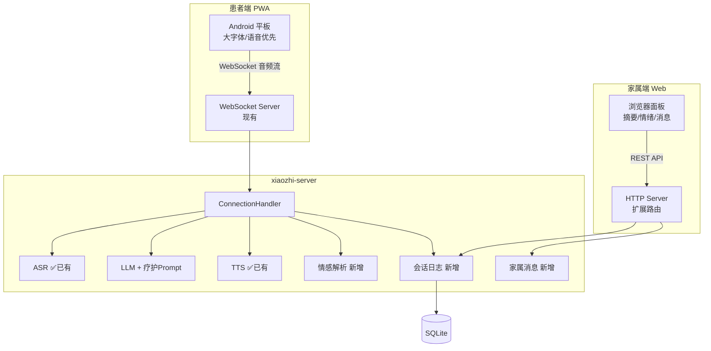

# 安宁疗护陪伴机器人 — Demo 实施方案

## 目标

基于 `xiaozhi-esp32-server`，开发可本地运行演示的 Demo：**患者端 PWA（Progressive Web App，渐进式Web应用）** + **家属端 Web 面板**。

---

## 为什么用 PWA 而不是原生 Android App？

| | PWA | 原生 Android App |
|---|---|---|
| **开发语言** | HTML/JS/CSS（你已经熟悉） | Kotlin/Java（需要学新技术栈） |
| **开发周期** | 3-5 天出 Demo | 至少 2-3 周 |
| **复用现有代码** | ✅ 直接复用 test_page 的 WebSocket + 录音模块 | ❌ 全部重写音频采集和 WebSocket 通信 |
| **安装方式** | Chrome 里"添加到主屏幕"，1 秒完成 | 需要打包 APK，签名，安装 |
| **用户体验** | 全屏运行，有桌面图标，和 App 一样 | 和 App 一样 |
| **调试效率** | 改代码刷新浏览器即可 | 每次改动需要重新编译部署 |
| **跨平台** | ✅ 同一套代码适配手机/平板/电脑 | ❌ 仅限 Android |
| **后续升级** | 服务器更新文件即可，用户无需操作 | 需要用户重新下载安装 APK |
| **麦克风/摄像头** | ✅ 浏览器完整支持 | ✅ 支持 |

**结论**：PWA 在 Demo 阶段优势碾压原生开发。如果后期需要蓝牙硬件控制等原生能力，可以用 Capacitor 把 PWA 一键打包成 APK，前端代码零修改。

---

## 架构总览



---

## 现有能力直接复用

| 需求 | 现有模块 | 状态 |
|------|---------|------|
| 语音对话 | WebSocket + VAD + ASR + LLM + TTS | ✅ 直接用 |
| 方言识别 | Paraformer-realtime-v2 | ✅ 四川话已验证 |
| 语音克隆 | Doubao Seed-TTS 2.0 ICL | ✅ 已集成 |
| 声纹识别 | voiceprint-api | ✅ 已部署 |
| 插件系统 | function_call + plugins | ✅ 可扩展 |

---

## 文件结构

```
apps/
├── patient/                    # 患者端 PWA
│   ├── index.html
│   ├── manifest.json           # PWA 安装配置
│   ├── sw.js                   # Service Worker
│   ├── css/hospice.css
│   ├── js/
│   │   ├── app.js              # 入口，复用现有录音/播放模块
│   │   ├── emotion-display.js  # 情绪可视化
│   │   └── accessibility.js    # 音量/语速控制
│   └── assets/icons/
│
└── family/                     # 家属端 Web
    ├── index.html
    ├── css/family.css
    └── js/
        ├── app.js
        ├── api.js              # REST 调用封装
        └── dashboard.js        # 摘要 + 情绪图表

core/api/
├── base_handler.py             # 已有
├── ota_handler.py              # 已有
├── vision_handler.py           # 已有
└── hospice/                    # 新增子目录
    ├── __init__.py
    ├── family_handler.py       # 家属端 API
    ├── session_handler.py      # 会话日志 API
    ├── media_handler.py        # 媒体管理 API
    └── storage.py              # 对话/情绪/家属消息 SQLite 持久化

core/providers/
└── emotion/                    # 新增
    └── llm_emotion.py          # 从 LLM 输出解析情感标签
```

---

## 患者端界面设计


---

## 安宁疗护 Prompt

```yaml
# data/.config_hospice.yaml
prompt: |
  你是"小暖"，一个温柔体贴的安宁疗护陪伴助手。
  
  ## 核心原则
  - 温暖、耐心、共情，不催促不评判
  - 简短温暖的句子回应，避免长篇大论
  - 适当使用四川方言亲切语气词（"嘛""噻""要得"）
  
  ## 你会做的
  - 倾听心声和回忆，陪聊家人和美好时光
  - 播放音乐或故事，引导呼吸放松
  
  ## 你不做的
  - 不给医疗建议，不讨论病情预后
  - 不说"加油""要坚强"等空洞鼓励
  
  ## 情感标注（系统用，用户不可见）
  每次回复末尾附加：<!--emotion:{"mood":"xxx","intensity":0.x}-->
```

---

## 数据库（SQLite）

```sql
CREATE TABLE conversation_log (
    id INTEGER PRIMARY KEY,
    device_id TEXT,
    session_id TEXT,
    timestamp DATETIME DEFAULT CURRENT_TIMESTAMP,
    role TEXT,             -- 'patient' | 'assistant'
    content TEXT,
    emotion_mood TEXT,
    emotion_intensity REAL
);

CREATE TABLE daily_summary (
    id INTEGER PRIMARY KEY,
    device_id TEXT,
    date DATE,
    summary TEXT,
    mood_trend TEXT,
    conversation_count INT,
    created_at DATETIME DEFAULT CURRENT_TIMESTAMP
);

CREATE TABLE family_message (
    id INTEGER PRIMARY KEY,
    device_id TEXT,
    sender_name TEXT,
    message_type TEXT,     -- 'voice' | 'photo' | 'text'
    file_path TEXT,
    played BOOLEAN DEFAULT FALSE,
    created_at DATETIME DEFAULT CURRENT_TIMESTAMP
);
```

---

## 家属端 API

```
GET  /api/hospice/summary/today      # 今日摘要
GET  /api/hospice/summary/history    # 历史摘要
GET  /api/hospice/emotion/today      # 今日情绪
GET  /api/hospice/emotion/trend      # 近7天趋势
POST /api/hospice/message            # 发送消息给患者
GET  /api/hospice/messages           # 消息列表
POST /api/hospice/media/upload       # 上传媒体
GET  /api/hospice/media/list         # 媒体列表
```

---

## 患者端 ↔ 家属端互动（分阶段）

### Phase 1：异步消息互发（文字 / 语音 / 视频留言）

复用现有 `family_message` 表，扩展 `message_type` 支持 `text | voice | photo | video`，并增加双向收发。

**数据库调整**：

```sql
ALTER TABLE family_message ADD COLUMN sender_role TEXT;  -- 'family' | 'patient'
ALTER TABLE family_message ADD COLUMN duration_ms INT;   -- 语音/视频时长
-- message_type 扩展 'video'
```

**API 扩展**：

```
POST /api/hospice/message              # 发送消息（支持 text/voice/photo/video）
GET  /api/hospice/messages             # 消息列表（按 sender_role 过滤）
POST /api/hospice/message/{id}/read    # 标记已读
GET  /api/hospice/message/stream       # SSE 推送新消息（两端通用）
```

**前端要点**：
- 患者端：录音/录像按钮大字化，收到家属消息自动语音播报（文字走 TTS，语音/视频直接播放）
- 家属端：文件上传 + 录音/录像组件，消息流按时间线展示
- 视频录制：`MediaRecorder` API，建议限制 ≤ 60s、输出 webm/mp4

### Phase 2：实时语音通话（WebRTC）

**只做语音，不做视频**，降低带宽和复杂度。视频通话列入 Phase 3。

**架构**：

```mermaid
sequenceDiagram
    家属端->>信令服务: 发起呼叫 (patient_device_id)
    信令服务->>患者端: incoming_call 事件
    患者端-->>信令服务: accept
    家属端->>信令服务: offer (SDP)
    信令服务->>患者端: offer
    患者端->>信令服务: answer (SDP)
    信令服务->>家属端: answer
    家属端<->>患者端: ICE candidates (通过信令转发)
    家属端<<->>患者端: P2P 音频流 (WebRTC)
```

**服务端新增**：
- 信令通道：复用 WebSocket server，新增 `type: call.*` 消息路由（offer/answer/ice/accept/reject/hangup）
- `core/api/hospice/call_handler.py`：管理通话会话、在线状态
- 部署 **coturn**（STUN + TURN），内网演示可先只用 STUN

**客户端**：
- 双端新增 `js/webrtc.js`，封装 `RTCPeerConnection`（只开 audio track）
- 患者端：来电全屏弹窗 + 大号"接听/挂断"按钮，铃声提示
- 通话中 AI 对话链路暂停（避免抢麦克风）

**配置示例**：

```yaml
# data/.config_hospice.yaml 新增
webrtc:
  ice_servers:
    - urls: "stun:stun.l.google.com:19302"
    - urls: "turn:your-turn.example.com:3478"
      username: "xxx"
      credential: "xxx"
  max_call_duration_sec: 1800
```

### Phase 3（后续规划）
- 实时视频通话（WebRTC + video track）
- 多方通话（家属多人同时接入）

---

## 非功能性需求（后续完善）

Demo 阶段先跑通功能，以下在正式部署时补充：

- **隐私安全**：SQLCipher 加密数据库 + 同意管理 + HTTPS/WSS 传输加密
- **可靠性**：进程守护自动重启 + WebSocket 断线重连 + 心跳检测
- **适老化**：物理音量键映射为备用操作 + 屏幕亮度自适应
- **扩展性**：利用现有插件架构，新功能 = 新插件文件（药物提醒、呼吸引导等）

---

## Demo 实施清单

- [ ] 新建 `data/.config_hospice.yaml`，写入疗护 Prompt + 模块配置
- [ ] 构建患者端 PWA（`apps/patient/`）
  - [ ] 适老化大按钮界面
  - [ ] 复用 WebSocket 音频通信
  - [ ] 音量/语速调节
  - [ ] 对话气泡展示
  - [ ] PWA manifest + Service Worker
- [ ] 新增情感解析模块（`core/providers/emotion/`）
- [ ] 新增会话日志模块（`core/api/hospice/storage.py`）
- [ ] 新增家属端 API（`core/api/hospice/`）
- [ ] 构建家属端 Web（`apps/family/`）
  - [ ] 今日摘要面板
  - [ ] 情绪状态展示
  - [ ] 发送语音/文字消息
- [ ] 本地运行验证，用平板访问测试
- [ ] **Phase 1：患者↔家属异步消息**
  - [ ] 扩展 `family_message` 表（sender_role / duration_ms / video 类型）
  - [ ] 双向消息 API + SSE 推送
  - [ ] 患者端录音/录像 UI + 消息流
  - [ ] 家属端录音/录像 UI + 消息流
- [ ] **Phase 2：实时语音通话**
  - [ ] WebSocket 信令路由（call.offer/answer/ice/accept/hangup）
  - [ ] 部署 coturn（或先用公共 STUN）
  - [ ] 双端 WebRTC 封装（仅 audio）
  - [ ] 患者端来电弹窗 + AI 对话链路互斥
  - [ ] 家属端拨号面板 + 通话状态

## Verification Plan

### 本地 Demo 验证
- 启动 xiaozhi-server，平板浏览器访问患者端 PWA
- 用四川话对话，检查回复语气是否温暖自然
- 电脑浏览器打开家属端，查看摘要和情绪数据
- 家属端发消息，患者端能播放
